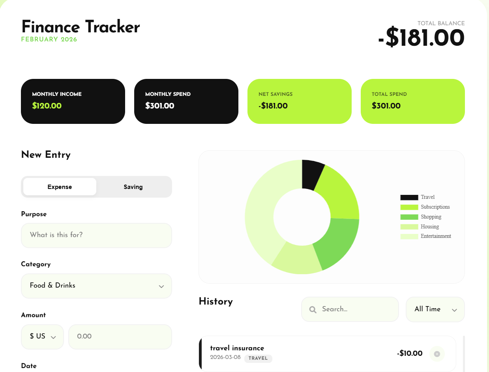
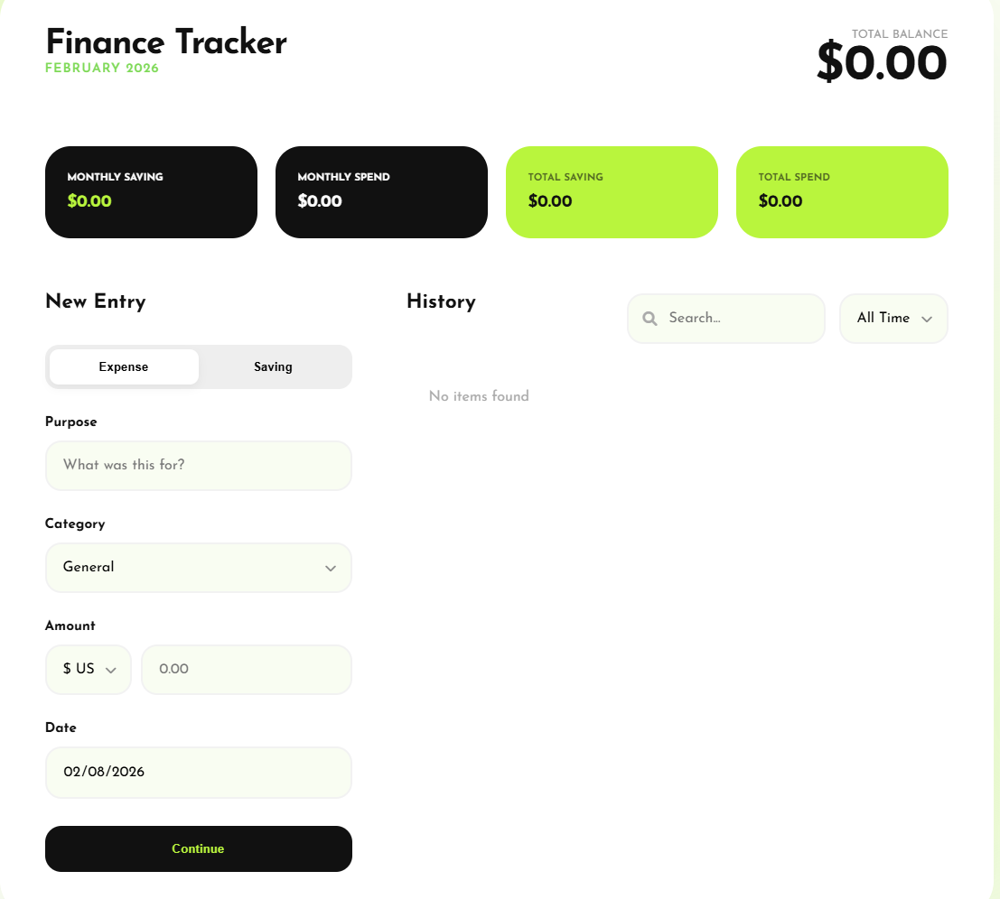

# 🍏 Finance Tracker | Neobrutalist Edition

A premium, minimalist dashboard designed for users who value privacy, speed, and clean aesthetics. This tool helps you visualize your spending without ever uploading your data to the cloud.

## screenshots

## 🚀 Features
- **100% Privacy:** No databases, no APIs, and no third-party trackers. All data is stored in your browser's `localStorage`.
- **Dynamic Analytics:** Real-time spending breakdown using **Chart.js**.
- **Multi-Currency:** Support for USD, EUR, and CAD with instant switching.
- **Smart History:** Monthly filtering and search capabilities for all transactions.
- **Neobrutalist UI:** A bold "Apple Lime" theme designed for high contrast and readability.

## 🛠️ Tech Stack
- **Frontend:** HTML5, CSS3 (Modern Flexbox/Grid)
- **Logic:** Vanilla JavaScript (ES6+)
- **Charts:** Chart.js (via CDN)
- **Typography:** Josefin Sans

## 📦 Installation & Usage
No build step required. This is a pure "Buy once, own forever" codebase.

1. Clone the repository: 
   `git clone https://github.com/tamar-natchkebia/finance-tracker.git`
2. Open `index.html` in any modern web browser.
3. Start tracking your wealth.

## 🔒 Security Policy
This application operates entirely on the client-side. 
- **Data Persistence:** Your data will persist as long as you don't clear your browser's cache/local storage.
- **Exporting:** (Optional: Add this if you have an export feature) Use the Export button to save a JSON backup of your data.

